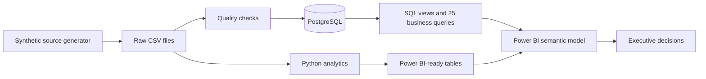
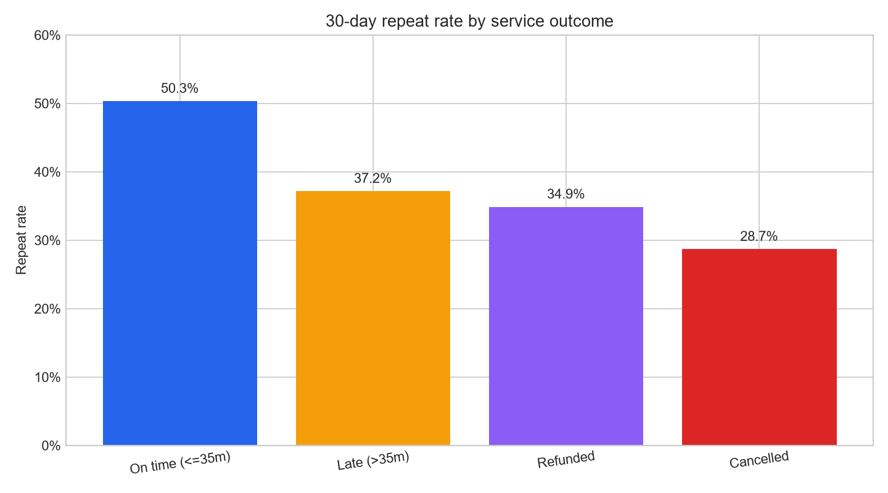
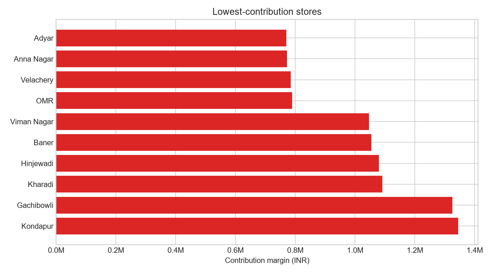
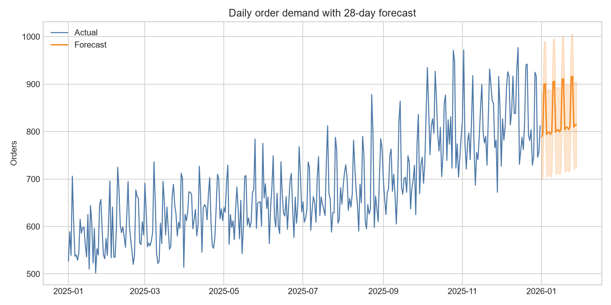

# RapidKart: Quick-Commerce Profitability & Retention Analytics


An end-to-end data analyst portfolio project that answers a realistic management question:

> Where are profitability and retention leaking, and which operational or product actions should the company take?

The project generates a reproducible, explicitly synthetic Indian quick-commerce dataset, validates it, models it in PostgreSQL, analyses it with Python, and produces Power BI-ready tables and measures.

## Why this project is stronger than a generic dashboard

- It starts with business decisions rather than charts.
- It separates GMV, net revenue, gross profit, and contribution margin.
- It covers customer cohorts, RFM, funnel analysis, A/B testing, operations, inventory, CAC, and forecasting.
- It contains automated data-quality tests and reproducible generation.
- It includes 25 documented SQL questions and a stakeholder-facing executive summary.
- It is honest about synthetic data and does not present simulated findings as real company results.

## Architecture



An exportable version is available at [assets/architecture.svg](assets/architecture.svg).

## Dataset

The full default build contains:

- 250,000 orders
- Approximately 700,000 order-item rows
- Approximately 830,000 app sessions
- 1,051,200 daily store-product inventory rows
- Customer, store, product, and marketing dimensions/facts

The exact counts are written to `data/raw/generation_metadata.json` after generation.

### Verified full-scale build

The complete seed-42 build was generated, validated, loaded into PostgreSQL, and analysed end to end:

| Layer | Verified result |
|---|---:|
| Orders | 250,000 |
| Order items | 764,979 |
| App sessions | 833,334 |
| Daily inventory rows | 1,051,200 |
| Data-quality checks | 38 passed, 0 failed |
| SQL business queries | 25 executed successfully |

The generated tables are intentionally Git-ignored because they are reproducible. Small evidence artifacts, charts, KPI results, and the executive memo are versioned in `outputs/`.

### Embedded business behaviour

The generator deliberately models several relationships for the analyst to discover:

- Late, cancelled, and refunded orders weaken subsequent repeat behaviour.
- Rain, traffic windows, distance, and store performance affect delivery times.
- A randomly assigned checkout treatment improves conversion by about four percentage points but adds discount cost.
- Perishable categories have higher waste.
- Weekend demand pressure increases stockout exposure.

These are simulation assumptions, not conclusions about a real company.

## Technology

- Python, Pandas, NumPy, SciPy, Matplotlib, Seaborn
- PostgreSQL 16 and advanced SQL
- Power BI, Power Query, and DAX
- Docker Compose
- Pytest

## Quick start

Prerequisites: Python 3.11+ and Docker Desktop.

```powershell
python -m venv .venv
.venv\Scripts\Activate.ps1
python -m pip install -r requirements.txt
Copy-Item .env.example .env
```

Run a smaller local build first:

```powershell
python -m src.pipeline --orders 5000 --inventory-days 14
```

This generates data, runs the quality checks, performs the analysis, and creates portfolio outputs without requiring PostgreSQL.

## Full portfolio build

Start PostgreSQL:

```powershell
docker compose up -d
```

Generate the complete dataset, load the database, and run the analysis:

```powershell
python -m src.pipeline --orders 250000 --inventory-days 365 --load-postgres
```

Or use the PowerShell helper:

```powershell
.\scripts\run_project.ps1 -Orders 250000 -InventoryDays 365 -LoadPostgres
```

The PostgreSQL loader recreates only the dedicated `qcommerce` schema. Do not point `DATABASE_URL` at a database where that schema contains unrelated work.

## Run components separately

```powershell
python -m src.generate_data --orders 250000 --inventory-days 365
python -m src.data_quality
python -m src.load_postgres
python -m src.analyze
pytest
```

## Repository structure

```text
.
|-- assets/                  # Architecture diagram
|-- data/
|   |-- raw/                 # Generated source tables (Git-ignored)
|   `-- processed/           # Power BI-ready analytical tables
|-- docs/                    # Business problem, dictionary, and interview guide
|-- outputs/                 # KPI JSON, charts, quality report, summary
|-- powerbi/                 # Model guide, DAX, theme, dashboard wireframe
|-- scripts/                 # Windows pipeline helper
|-- sql/                     # Schema, views, indexes, and business queries
|-- src/                     # Generator, validation, loader, and analysis
`-- tests/                   # End-to-end tests
```

## Power BI

Follow [powerbi/model_and_build_guide.md](powerbi/model_and_build_guide.md), paste measures from [powerbi/measures.dax](powerbi/measures.dax), and import [powerbi/rapidkart_theme.json](powerbi/rapidkart_theme.json).

The recommended four pages are:

1. Executive Overview
2. Customer & Retention
3. Store Operations
4. Product & Inventory

## Verified portfolio outputs

The repository includes the output of the full 250,000-order build:

- [Executive summary](outputs/executive_summary.md)
- [Executive KPI values](outputs/executive_kpis.json)
- [Data-quality report](outputs/data_quality_report.json)
- [Full-scale findings](docs/sample_findings.md)

### Service outcome and 30-day repeat behaviour



### Store contribution-margin risk



### Daily demand and 28-day baseline forecast



## Portfolio presentation

Use the generated `outputs/executive_summary.md` as the basis for a one-page memo. In an interview, explain:

1. The business decision and KPI definitions
2. The grain of every fact table
3. How data quality was verified
4. What the analysis found
5. What action you recommend
6. What you would validate with real production data

Do not lead with “I made a dashboard.” Lead with the decision you enabled.

## Documentation

- [Business problem](docs/business_problem.md)
- [Data dictionary](docs/data_dictionary.md)
- [Analytical assumptions](docs/analytical_assumptions.md)
- [Interview and presentation guide](docs/interview_guide.md)
- [Verified full-scale findings](docs/sample_findings.md)
- [Power BI dashboard wireframe](powerbi/dashboard_wireframe.md)

## Limitations

- All company and customer data is synthetic.
- The forecast is an interpretable baseline, not a production forecasting system.
- Simulated association should not be presented as real-world causation.
- Power BI Desktop is required to create the `.pbix`; the repository supplies the model, outputs, theme, measures, and build instructions because `.pbix` is a proprietary binary artifact.
